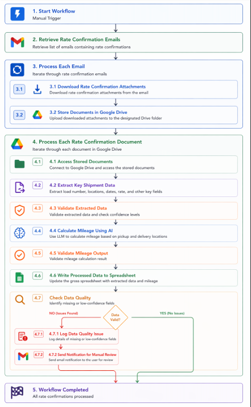
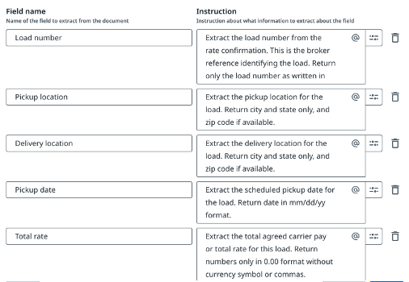
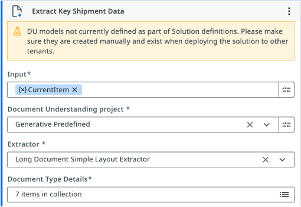
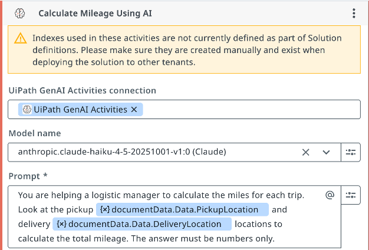
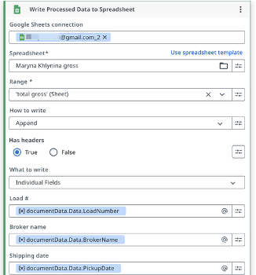
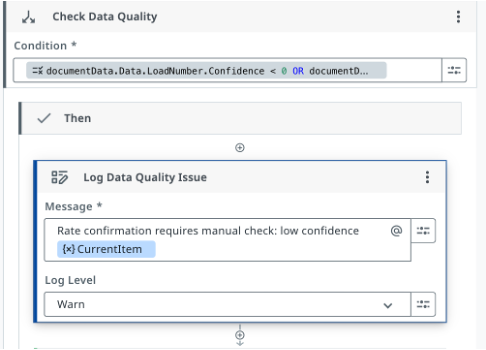
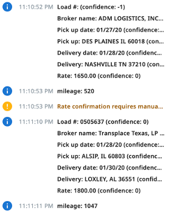
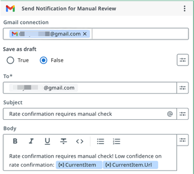
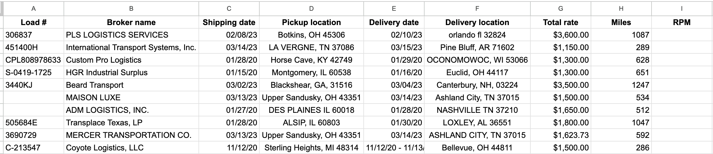

# AI-Powered Logistics Operations Automation

AI-powered UiPath automation designed to streamline logistics rate confirmation processing through document extraction, mileage enrichment, validation workflows, and structured operational reporting.

The workflow transforms unstructured broker rate confirmations into structured shipment data, reducing repetitive manual work and improving reporting efficiency across carrier operations.

---

## Business Context

Carrier operations teams process large volumes of broker rate confirmations daily. Manual processing requires repetitive document review, shipment data extraction, mileage lookup, spreadsheet entry, and RPM reporting.

This creates operational bottlenecks, increases the risk of manual errors, and limits reporting scalability.

---

## Automation Solution

An end-to-end UiPath workflow was developed to automate rate confirmation processing through:

- Automated email intake
- Document Understanding extraction
- AI-powered mileage calculation
- Validation and monitoring logic
- Structured reporting output in Google Sheets

The workflow converts unstructured shipment documents into structured operational data for reporting and operational analysis.

---

## Technologies Used

- UiPath
- UiPath Document Understanding
- Generative Extractor
- AI / LLM Integration
- Google Drive
- Google Sheets
- Gmail Integration
- Validation & Monitoring Logic
- Logging & Debugging Workflows

---

## Key Features

- Automated retrieval of broker rate confirmations
- Shipment data extraction from PDF documents
- AI-based mileage calculation
- Validation and low-confidence detection
- Automated alert notifications
- Structured spreadsheet reporting
- RPM reporting support

---

## Key Outcomes

- ~70–80% reduction in repetitive manual processing
- Automated processing of shipment confirmations
- Reduced repetitive data entry and manual lookup
- Faster RPM reporting workflows
- Improved operational visibility
- Supports scalable shipment document processing

---

## Workflow Architecture

---

## Document Understanding Pipeline

---

## Custom Extraction Fields

---

## AI-Powered Mileage Calculation

---

## Data Mapping & Debugging

---

## Validation Logic

---

## Workflow Monitoring & Alerts

---

## Structured Reporting Output

---

## Documentation

Additional project documentation and presentation materials are available in the `/docs` folder.